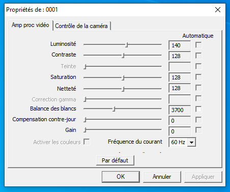
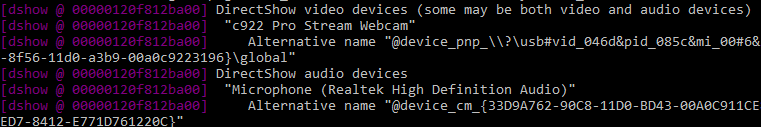

This is a small script I made to launch the webcam settings dialog directly from Windows (the same dialog as StreamLabs). In my case, the Logitech G HUB application doesn't have all the same settings as this dialog window, that's why it is useful. If you want to adjust more precisely your webcam when you use it for Zoom, Facebook or anything else, this is the script you need.

This is nowhere near perfect, I made this in 15 minutes. If you can make it better, please do! The files are heavy because of the ffmpeg executable needed for this to work.

# How to use

## 1. Download

Download the files and place them in a folder somewhere on your computer.

## 2. Find out your webcam name

Make sure your webcam is connected and launch **whatismycam.bat**. A window like this will appear:

Find out what is the exact name of your webcam, for example mine is **c922 Pro Stream Webcam**, copy this somewhere.

## 3. Set your webcam name

Edit the file **webcamdialog.bat** with notepad and change the **cam** variable to your camera name (within the quotes):

    set cam="YOUR WEBCAM NAME"
    ffmpeg -f dshow -show_video_device_dialog true -i video=%cam%

In my case, I edited the file to:

    set cam="c922 Pro Stream Webcam"
    ffmpeg -f dshow -show_video_device_dialog true -i video=%cam%

## 4. Place a shortcut on your desktop (optional)

At this point, you can simply launch, by double clicking, the file **launch.bat** and the dialog window will appear. But I suggest you create a shortcut of **launch.bat** on the desktop and launch it from there.

Voila! Hope it works for you.